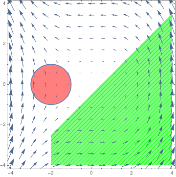
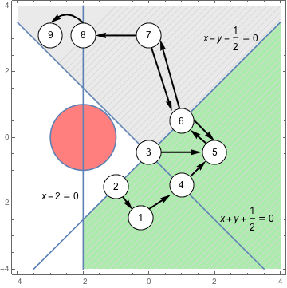

# Semi-algebraic ABstrAcTor for Hybrid systems (SABbATH)

SABBATH is a formal verification and synthesis tool for dynamical and hybrid systems jointly developed by LIX - \'Ecole Polytechnique and Fondazione Bruno Kessler (FBK).

The tool implements the algorithm presented in:

[1] Sergio Mover, Alessandro Cimatti, Alberto Griggo, Ahmed Irfan, Stefano Tonetta. Implicit Semi-Algebraic Abstraction for Polynomial Dynamical Systems. CAV 2021

[2] Stylianos Basagiannis, Ludovico Battista, Anna Becchi, Alessandro Cimatti, Georgios Giantamidis, Sergio Mover, Alberto Tacchella, Stefano Tonetta and Vassilios Tsachouridis. SMT-Based Stability Verification of an Industrial Switched PI Control Systems. 1st International Workshop on Verification & Validation of Dependable Cyber-Physical Systems 2023


Up to now SABBATH, provides the following main functionalities:

a. Verify invariant properties for polynomial dynamical systems (i.e., dynamical systems with a polynomial Ordinary Differential Equations): [verify.py](#a. Verifying invariant properties for polynomial dynamical systems)

The tool implements the algorithm of [1] (using verification modulo theory techniques as backend, i.e., ic3IA) and the algorithms (dwcl, reach) from:

Andrew Sogokon, Khalil Ghorbal, Paul B. Jackson, André Platzer. A Method for Invariant Generation for Polynomial Continuous Systems. VMCAI 2016

b. Verify invariant properties for hybrid systems with polynomial dynamics [experimental]: [verify_hs.py](#b. Verify invariant properties for hybrid systems with polynomial dynamics)

c. Synthesise lyapunov functions and for 2-mode switched affine linear system: [stability_hs.py](#c. Synthesise lyapunov functions and for 2-mode switched affine linear system)

** Contact **: Sergio Mover, LIX and Ecole Polytechnique at name.surname <at> lix.polytechnique.fr)

## Installation

### Dependencies
- python3
- pysmt (https://github.com/pysmt/pysmt)
- z3 solver (https://github.com/Z3Prover/z3)
- ic3ia (https://es-static.fbk.eu/people/griggio/ic3ia/index.html)

To install the base dependencies on Ubuntu you can try the following commands:
```bash
$ sudo apt-get install python python-pip
$ sudo apt install -y build-essential swig libgmp-dev cmake
$ pip install nose pysmt sympy ply six scipy
$ pysmt-install --confirm-agreement --z3 --bdd
```

#### For verification

The tool uses different backends depending on the verification algorithm.

To use the VMT verification algorithm you need to install the `ic3ia` tool from the [ic3ia website](https://es-static.fbk.eu/people/griggio/ic3ia/index.html).

The tool can use Mathematica (instead of z3 as SMT solver) as backend of the `dwcl` and `reach` algorithm. You can install the [Wolfram Engine](https://www.wolfram.com/engine/), which implements the Mathematica backend and at the moment is free for academic purposes, or directly  Mathematica, and then install the `wolframclient` python package:
```
pip install wolframclient
```

#### For synthesis

The synthesis package uses `picos` as interface to different SDP solvers and the `control` package:
```
pip install picos control
```


## a. Verifying invariant properties for polynomial dynamical systems 

The script *verify.hs* runs the verification algorithms for polynomial dynamical systems.

Consider the dynamical system:
$$
\begin{align*}
\dot{x} &= -2 * y\\
\dot{y} &= x^2\\
\end{align*}
$$

starting from the initial set:
$$
x + 2 > 0 \land 0 <= x - y - \frac{1}{2}
$$

and the safety set:
$$
(x + 2)^2 + y^2 - 1 > 0
$$



SABBATH verify if the dynamical system is safe analyzing a semi-algebraic decomposition of the state space  (i.e., a discrete abstraction that partition). The decomposition uses the following polynomials:
$$
\begin{align*}
x - y - \frac{1}{2}  = 0\\
x + y + \frac{1}{2} = 0\\
x + 2 = 0
\end{align*}
$$
to create a discrete abstraction where each state assigns a different sign to each polynomial:



This system and the polynomials are written in the file [3D_Lotka_Volterra__I_.invar](barrier/test/invar_inputs/3D_Lotka_Volterra__I_.invar), which follows the [input format](docs/input_format.md).

You can verify the system using the `ic3ia` SMT-based algorithm:
```
python verify.py --task ic3ia ./barrier/test/invar_inputs/Liu_Zhan_Zhao_Emsoft11_Example_25_motivating.invar 
```

The tool outputs several statitics, and eventually the result:
```
Liu Zhan Zhao Emsoft11 Example 25 new example Result.SAFE
```

You can change the algorithm in the `task` parameter (using `dwcl` and `reach`). Look at the help `verify.py --h` to get a list of the available options.


## b. Verify invariant properties for hybrid systems with polynomial dynamics

The tool can verify a hybrid system is safe 

## c. Synthesise lyapunov functions and for 2-mode switched affine linear system

